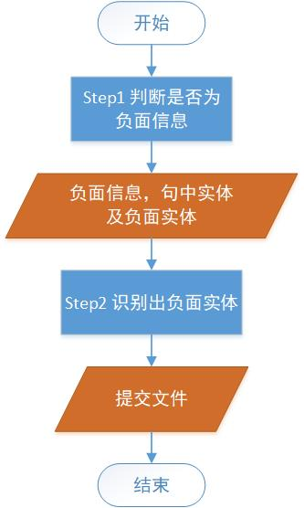
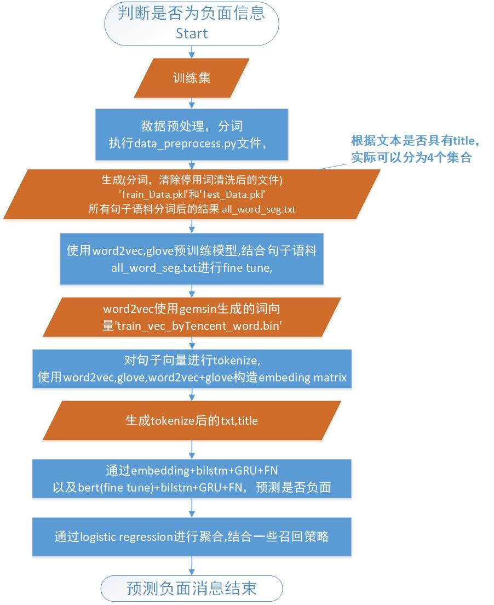
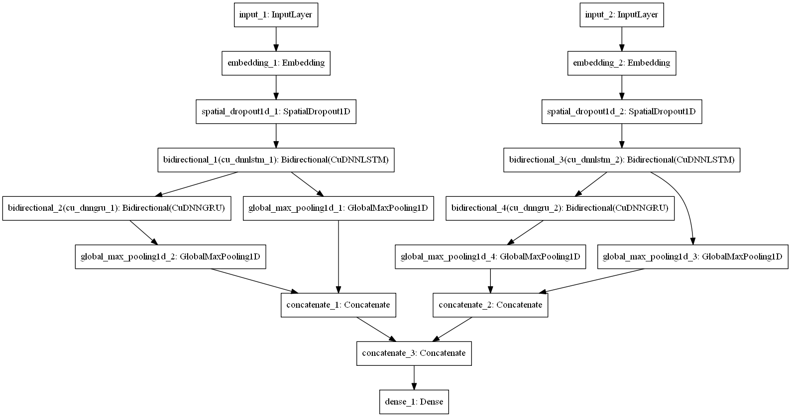

# 金融负面实体识别

> #### 赛题任务 Question Task
>
> 该任务分为两个子任务：
> 给定一条金融文本和文本中出现的金融实体列表，
>
> 1. 负面信息判定：判定该文本是否包含金融实体的负面信息。如果该文本不包含负面信息，或者包含负面信息但负面信息未涉及到金融实体，则负面信息判定结果为0。
> 2. 负面主体判定：如果任务1中包含金融实体的负面信息，继续判断负面信息的主体对象是实体列表中的哪些实体。

比赛链接：https://www.datafountain.cn/competitions/353

[TOC]


# 1. 数据描述

## 1.1 训练集
**路径**：
https://github.com/cjn-chen/detect_negative_financial_sentences/blob/master/data/Train_Data.csv

| 字段信息 Field Info |                类型 Type                 |                       描述 Description                       |
| :-----------------: | :--------------------------------------: | :----------------------------------------------------------: |
|         id          |                  String                  |                        数据ID Data ID                        |
|        title        |                  String                  |                     文本标题 Text title                      |
|        text         |                  String                  |                    文本内容 Text content                     |
|       entity        |                  String                  |                给定的实体列表 Given entities                 |
|      negative       | String<font color='red'>（label）</font> | 文本是否包含负面信息 Does the text contain negative information |
|     key_entity      | String<font color='red'>（label）</font> |                     负面主体 Key entity                      |

**示例**

| id       | title                                         | text                                                         | entity                                       | negative | key_entity                          |
| -------- | --------------------------------------------- | ------------------------------------------------------------ | -------------------------------------------- | -------- | ----------------------------------- |
| f3acce86 | ????#新闻资讯[超话]##小资钱包涉嫌诈骗[超话]## | ????#新闻资讯[超话]##小资钱包涉嫌诈骗[超话]##扫黑除恶[超话]#   (北京)资易贷金融信息服务有限公司简称小资钱包平台虚假标出借，伪造出借合同，自融资金池，资金流向开夜总会和放高利贷的黑恶势力团伙 | 小资钱包;资易贷金融信息服务有限公司;易贷金融 | 1        | 小资钱包;资易贷金融信息服务有限公司 |

## 1.2 测试集

**路径**：https://github.com/cjn-chen/detect_negative_financial_sentences/blob/master/data/Test_Data.csv

| 字段信息 Field Info | 类型 Type |       描述 Description        |
| :-----------------: | :-------: | :---------------------------: |
|         id          |  String   |        数据ID Data ID         |
|        title        |  String   |      文本标题 Text title      |
|        text         |  String   |     文本内容 Text content     |
|       entity        |  String   | 给定的实体列表 Given entities |

 **示例**

| id       | title                                                        | text                                                         | entity          |
| -------- | ------------------------------------------------------------ | ------------------------------------------------------------ | --------------- |
| f3b61b38 | ????#小资钱包涉嫌诈骗[超话]#李兆民～海淀区资易贷(小资钱包)诈骗证据集锦   绳之以法李兆民 | ????#小资钱包涉嫌诈骗[超话]#李兆民～海淀区资易贷(小资钱包)诈骗证据集锦   绳之以法李兆民，罪责难逃潘博艺，洗黑钱法人孙正，为虎作伥是张赛，黑社会老大伟强，扫黑除恶看海淀，为民除害美名扬！@海淀检察 @北京海淀法院 @海淀公安分局   @海淀在线 @海淀新闻 @全国打黑办 @任玉岭 @解思忠 @欧洲时报    ????? | 小资钱包;资易贷 |

## 1.3 提交文件(输出描述）

读取测试集内容，输出训练集中的label信息。输出文件的格式如下：
| id   | negative | key_entity |
| :--- | :------- | :--------- |
| f3b61b38 | 0 |           |
|84b12bae| 0  |          |

第一列为id，来自测试集中；

第二列为label，表示是否为实体；

第三列为识别出来的负面实体，从测试集中的entity中选取。

# 2. 算法流程

## 2.1 流程图

总流程图为计划使用的处理方式，考虑到实体名词与是否为负面信息不应该由直接关系，可以先判断是否为负面信息（**step1**），再判断实体中哪部分是负面实体(**step2**)。

<center></center>
<center>总流程</center>
<center></center>
<center>Step 1 识别负面信息</center>

## 2.2 数据预处理

**执行文件**：[data_preprocess.py](https://github.com/cjn-chen/detect_negative_financial_sentences/blob/master/data_preprocess.py)

### 2.2.1 预处理步骤

1. 处理训练集和测试集中异常符号，比如"?","<"等； [查看代码](https://github.com/cjn-chen/detect_negative_financial_sentences/blob/master/data_preprocess.py#L18-L40)
2. 提取训练集中所有entity，生成文件'**financial_entity.txt**'和'**financial_entity_test.txt**'，供jieba模块加载作为自定义字典；[查看代码](https://github.com/cjn-chen/detect_negative_financial_sentences/blob/master/data_preprocess.py#L123-L129)
3. 通过训练集分析jieba模块分词结果，通过jieba.suggest_freq(entity, tune=True)进行微调；[查看代码](https://github.com/cjn-chen/detect_negative_financial_sentences/blob/master/data_preprocess.py#L132-L154)
4. 使用jieba，将Train_Data.csv中的title和text字段进行分词，按照空格分隔，生成txt_split和title_split字段，输出“**Train_Data.pkl**”文件；[查看代码](https://github.com/cjn-chen/detect_negative_financial_sentences/blob/master/data_preprocess.py#L156-L159)
5. 同理，也对测试集进行一样的处理，生成“**Test_Data.pkl**”文件。
6. 生成“**all_word_seg.txt**”文件，将所有分割的结果，包括训练集和测试集的title_split，txt_split字段合并，每行为一个句子，空格分割。用于生成词语到index的token词典，类似keras的Tokenizer。[查看代码](https://github.com/cjn-chen/detect_negative_financial_sentences/blob/master/data_preprocess.py#L199-L205)

### 2.2.2 生成文件及示例

- **financial_entity.txt和financial_entity_test.txt示例**

第一列为需要分词的词语，第二列为该词的频率，设置为999强制分词。

> OKCOIN 999
>
> 一飞冲天 999
>
> 云动 999
>
> 乔司商城 999

- **Train_Data.pkl示例**

title字段经过分词处理后得到title_split字段，其中，加粗字体经过分词后变为title_split中的加粗字体。

| id       | title                                                        | text                                                         | entity                                             | negative | key_entity                                  |
| -------- | ------------------------------------------------------------ | ------------------------------------------------------------ | -------------------------------------------------- | -------- | ------------------------------------------- |
| ffeb4962 | 北京 **小资钱包涉嫌诈骗 李兆民是小资钱包公司法人 潘博艺为资易贷** 北京 金融信息服务有限公司 简称 小资钱包 P2P平台 实控人   自2018年9月爆发大面积 几乎全部 逾期至今已8个月 | 北京 小资钱包涉嫌诈骗 李兆民是小资钱包公司法人 潘博艺为资易贷 北京 金融信息服务有限公司 简称小资钱包P2P平台 实控人   自2018年9月爆发大面积 几乎全部 逾期至今已8个月 | 资易贷（北京）金融信息服务有限公司;小资钱包;资易贷 | 1        | 资易贷（北京）金融信息服务有限公司;小资钱包 |

| title_split                                                  | txt_split                                                    |
| ------------------------------------------------------------ | ------------------------------------------------------------ |
| 北京 **小资钱包   涉嫌 诈骗 李兆民 是 小资钱包 公司法人 潘博艺 为 资易贷** 北京 金融信息 服务 有限公司 简称 小资钱包 P2P 平台 实控 人 自 年 月 爆发   大面积 几乎 全部 逾期 至今 已 个 月 | 北京 小资钱包 涉嫌 诈骗 李兆民 是 小资钱包 公司法人 潘博艺   为 资易贷 北京 金融信息 服务 有限公司 简称 小资钱包 P2P 平台 实控 人 自 年 月 爆发 大面积 几乎 全部 逾期 至今 已 个   月 |

- **Test_Data.pkl**

  也是一样的处理方式，结果和Train_Data.pkl相似，此处不加赘述。

- **all_word_seg.txt**

每行为一个句子，通过空格进行了分词

> 月 日 i财富 的 公司 主体 深圳前海大福资本管理有限公司 因涉嫌 非法 吸收 公众 存款 案 被 立案侦查
> 目前 推送 两次 已 通过 水滴筹 互助 平台 线上 销售 了 万 多斤 安徽 壹号 农仓 负责人 李红林 说
>
> 中新网 月 日电 据 保监会 网站 消息 保监会 有关 部门 负责人 就 网络 互助 平台 有关 问题 表示 保监会 对 水滴互助 等 网络 互助 平台 负责人 进行 重点 约谈 并 通报 监管 意见

## 2.3 训练词向量

使用**gensim模块**，根据预训练的模型，结合“all_word_seg.txt”给出的分隔后的句子，fine tune为适合训练集和测试集的词向量模型。

### 2.3.1 一个简单的例子

此节给出了一个简单的例子，model1对应于预训练模型，sentences对应与本地语料，wv_from_text就是最终模型。见[learn_word2vec_pre-train_vec.py](https://github.com/cjn-chen/detect_negative_financial_sentences/blob/master/learn_word2vec_pre-train_vec.py#L11-L37)

```python
#%% 1.case
sentences = [['first', 'sentence'], ['second', 'sentence']]

wv_from_text = word2vec.Word2Vec(size=10, min_count=1)  # 创建word2vec的结构
# 往字典中加入新的词语,并构造哈夫曼树用于字典的查询
# 初始化字典, 训练的时候,只会训练字典里有的词语对应的词向量
wv_from_text.build_vocab(sentences)
total_examples = wv_from_text.corpus_count  # 参与训练的语料数目

# 训练第二个词向量，预训练模型
sentences2 = [['third', 'sentence'], ['fourth', 'sentence']]
model1 = word2vec.Word2Vec(sentences2, min_count=1, size=10)  # 会自动加入词向量的字典
model1.wv.save_word2vec_format('test.txt')  # save the model

# 混合两个模型
wv_from_text.build_vocab([list(model1.wv.vocab.keys())], update=True)  # 加入新的字典的key
# lockf:Use 1.0 to allow further training updates of merged vectors.
# Merge in an input-hidden weight matrix loaded from the original C word2vec-tool format,
# where it intersects with the current vocabulary.
wv_from_text.intersect_word2vec_format("test.txt", binary=False, lockf=1.0)
wv_from_text.train(sentences, total_examples=total_examples, epochs=wv_from_text.epochs)
```
### 2.3.2 训练词向量——基于腾讯预训练词向量

腾讯预训练词向量下载地址: https://ai.tencent.com/ailab/nlp/embedding.html，<font color='red'>该词向量模型较为占用内存，建议在内存大于32G的电脑上采用，或者采用更小规模的预训练模型。</font>

运行文件[learn_word2vec_pre-train_vec.py](https://github.com/cjn-chen/detect_negative_financial_sentences/blob/master/learn_word2vec_pre-train_vec.py) 其中word2vec_with_pre_train函数使用了前文提及的all_word_seg.txt文件，fine tune了词向量模型。

需要注意，预训练模型的命名可以在main函数中修改，输出模型的文件名称也可以修改。

```python
if __name__ == '__main__':
    # 腾讯词向量模型文件名称为：
    pre_trained_word2vec_bin_file = "Tencent_AILab_ChineseEmbedding.txt"
    # fine tune后的词向量模型为：
    output_word2vec = 'train_vec_byTencent_word.bin'
    word2vec_with_pre_train(pre_trained_word2vec_bin_file, output_word2vec)
```

## 2.4 生成Token字典，嵌入矩阵

执行文件:[word_model2embeding_matrix.py](https://github.com/cjn-chen/detect_negative_financial_sentences/blob/master/word_model2embeding_matrix.py)

### 2.4.1 生成步骤

1. **确定词典构成**，载入训练集及测试集中分词结果，以及所有标注的entity，将出现的所有词语记为set_entities，将词向量模型中出现的句子记为set_entities_word2vec，取两者的交集set_final_entities。

2. **构造嵌入矩阵**，载入训练好的词向量模型，矩阵的行是字典中的词语，矩阵的列是每个嵌入的维度。

3. **构造Token词典**，key为需要嵌入的词语，比如"白条"，value为对应的下标，该下标与嵌入矩阵的行对应，比如，{'白条':1}，意味着

4. **保存数据**，嵌入矩阵保存为“word2idx_embedMatrix.pkl”，训练集数据保存为train_data_model.pkl，测试集数据保存为test_data_model.pkl。

### 2.4.2 切换使用的词向量模型

修改[word_model2embeding_matrix.py](https://github.com/cjn-chen/detect_negative_financial_sentences/blob/master/word_model2embeding_matrix.py)中

```python
#%% 1.生成嵌入矩阵,单词的字典
model = KeyedVectors.load_word2vec_format('train_vec_byTencent_word.bin', binary=True)
```

### 2.4.3 输出文件说明

<font color="red">考虑到文件大小限制</font>，大小大于50M的文件都经过压缩。

- **word2idx_embedMatrix.pkl**

由Token词典与嵌入矩阵构成的list。调用方式，嵌入矩阵和Token字典形式如下：

注意，<font color='red'>嵌入矩阵的第一行为全0向量，作为未登录词（嵌入矩阵中未出现的词语，记为[UNW]）的向量</font>

```python
with open('word2idx_embedMatrix.pkl', 'rb') as f:
    #　注意读取为rb
    word2idx, embedMatrix = pickle.load(f)
    
embedMatrix
Out[18]: 
array([[ 0.        ,  0.        ,  0.        , ...,  0.        ,
         0.        ,  0.        ],
       [ 0.21270299, -0.14471884, -0.17395827, ..., -0.09479144,
         0.10838169,  0.48032784],
       [ 0.17921589, -0.02162702,  0.13524926, ..., -0.08790409,
        -0.35757509,  0.07618757],
       ...,
       [ 0.00212055, -0.00523316, -0.00803086, ..., -0.00244891,
         0.00075081,  0.00434033],
       [-0.0938833 , -0.05811658, -0.31045881, ..., -0.08298918,
        -0.11453627, -0.00539324],
       [ 0.17047283,  0.08303674,  0.17097637, ..., -0.09937879,
        -0.41350007,  0.14077947]])
Token
{...
 '全方位': 996, #对应于embedMatrix[996,:]
 '伏法': 997,
 '几十万元': 998,
 '1号店': 999,
 '传谣': 1000,
 ...}
```

- **train_data_model.pkl**

  读入为字典，字典的key和value描述如下：

  | key                   | value描述                                         |
  | --------------------- | ------------------------------------------------- |
  | X_train_txt           | txt字段对应的Token向量，每个位置为词对应的index   |
  | X_train_txt_max_len   | txt字段的最大长度                                 |
  | X_train_title         | title字段对应的Token向量，每个位置为词对应的index |
  | X_train_title_max_len | title字段的最大长度                               |
  | y_train               | 是否为负面消息，由0，1组成                        |

  ```python
  with open('train_data_model.pkl', 'rb') as f:
  	train_data = pickle.load(f)
  
  train_data
  Out[22]: 
  {'X_train_title': array([[    0,  6582,     0, ...,     0,     0,     0],
          [    0, 15397,     0, ...,     0,     0,     0],
          [    0,     0,     0, ...,     0,     0,     0],
          ...,
          [    0,     0,     0, ...,     0,     0,     0],
          [15397, 10379, 15397, ...,     0,     0,     0],
          [    0, 22052,  7420, ...,     0,     0,     0]]),
   'X_train_title_max_len': 31,
   'X_train_txt': array([[23891, 16957, 31782, ...,     0,     0,     0],
          [15397, 28548, 13659, ...,     0,     0,     0],
          [17505, 29826, 10017, ...,     0,     0,     0],
          ...,
          [15938, 15800, 14781, ...,     0,     0,     0],
          [15397, 10379, 15397, ...,     0,     0,     0],
          [ 9327,  8915,   485, ...,     0,     0,     0]]),
   'X_train_txt_max_len': 3154,
   'y_train': array([0, 1, 1, ..., 1, 1, 0], dtype=int64)}
  ```

  

- **test_data_model.pkl**

  test_data_model.pkl只比train_data_model.pkl少了"y_train"字段。

## 2.5 训练模型

### 2.5.1 关于f1的实现

由于Keras中没有f1，于是使用自定义的f1计算方式进行计算f1。[见代码](https://github.com/cjn-chen/detect_negative_financial_sentences/blob/master/model_from_kaggle.py#L19-L56)

### 2.5.2 模型v1.0

#### 模型结构图

input_1和input_2分别为title和txt。



#### 核心代码

```python
def build_model_add_title2(embedding_matrix, learning_rate, nb_words,
                          max_length=55, max_length_title=55,
                          embedding_size=200, metric = f1):
    '''
    根据预训练的嵌入矩阵，返回神经网络的模型，返回模型还需要调用model.fit模块
    Args:
        embedding_matrix:嵌入矩阵,每行为一个单词，每列为其中一个维度
        learning_rate:学习率的大小
        nb_words:词汇表大小，设置为出现过的词汇数目+1，空的位置留给OOV(out of vocabulary),
        max_length:txt中句子的最大长度
        max_length_title:title中句子的最大长度
        embedding_size:嵌入矩阵的嵌入维度，即嵌入矩阵embedding_matrix.shape[1]
        metric:使用的评价方式
    '''
    inp = Input(shape=(max_length,))  # 定义输入 txt
    inp_title = Input(shape=(max_length_title,))  # 定义输入 title
    # txt
    x = Embedding(nb_words, embedding_size, weights=[embedding_matrix], trainable=False)(inp)# 嵌入层
    x = SpatialDropout1D(0.3)(x)  # 对某一个维度进行dropout,embedding中的某一列
    x1 = Bidirectional(CuDNNLSTM(256, return_sequences=True))(x)  # 使用GPU加速的LSTM
    x2 = Bidirectional(CuDNNGRU(128, return_sequences=True))(x1)  # 使用GPU加速的GRU
    max_pool1 = GlobalMaxPooling1D()(x1)  #对于时序数据的全局最大池化，
    max_pool2 = GlobalMaxPooling1D()(x2)  #对于时序数据的全局最大池化。
    conc = Concatenate()([max_pool1, max_pool2])  # 合并两层
    
    # title
    x_title = Embedding(nb_words, embedding_size, weights=[embedding_matrix], trainable=False)(inp_title)# 嵌入层
    x_title = SpatialDropout1D(0.3)(x_title)  # 对某一个维度进行dropout,embedding中的某一列
    x1_title = Bidirectional(CuDNNLSTM(256, return_sequences=True))(x_title)  # 使用GPU加速的LSTM
    x2_title = Bidirectional(CuDNNGRU(128, return_sequences=True))(x1_title)  # 使用GPU加速的GRU
    max_pool1_title = GlobalMaxPooling1D()(x1_title)  #对于时序数据的全局最大池化，
    max_pool2_title = GlobalMaxPooling1D()(x2_title)  #对于时序数据的全局最大池化。
    conc_title = Concatenate()([max_pool1_title, max_pool2_title])  # 合并两层
    
    conc_all = Concatenate()([conc, conc_title])
    
    predictions = Dense(1, activation='sigmoid')(conc_all)
    model = Model(inputs=[inp, inp_title], outputs=predictions)
    adam = optimizers.Adam(lr=learning_rate)
    model.compile(optimizer=adam, loss='binary_crossentropy', metrics=[f1])
    return model
```

